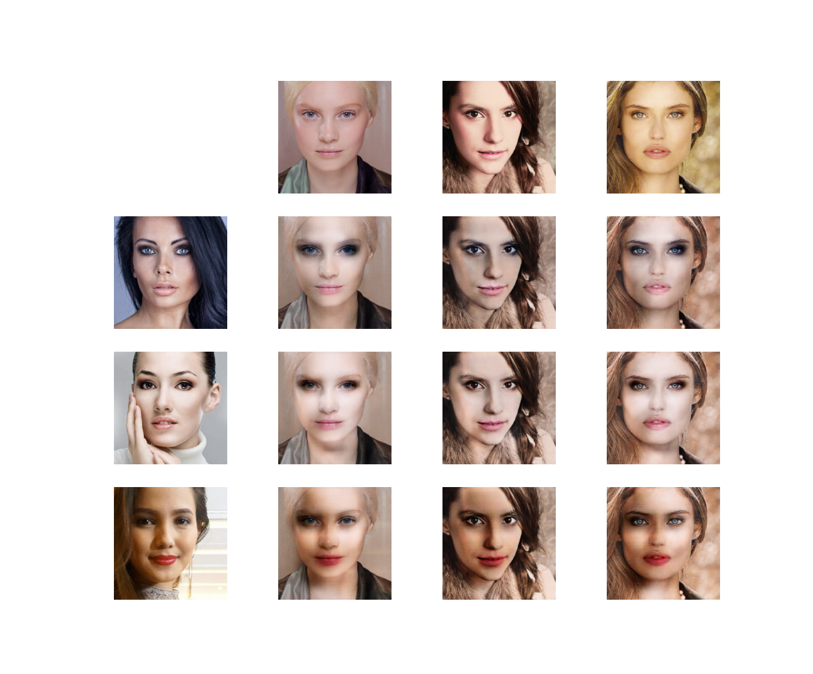

# BeautyGAN tensorflow

Reimplementation of BeautyGAN in tensorflow based on paper [BeautyGAN: Instance-level Facial Makeup Transfer with Deep Generative Adversarial Network](http://colalab.org/media/paper/BeautyGAN-camera-ready.pdf).

Webcam demo: https://marekpokropinski.github.io/beauty_gan/.
In demo application first select target makeup image. Then click on start video to apply target makeup on video feed.

Dataset: https://drive.google.com/open?id=18UlvYDL6UGZ2rs0yaDsSzoUlw8KI5ABY (original dataset used in paper)

# Example makeup transfer

